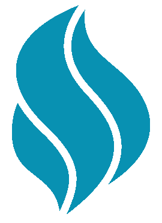

<h1>Game Deal</h1>

Saiba quando o preço de um jogo cair.

[APP](https://app.gamedeal.cloudns.app) |
[API](https://api.gamedeal.cloudns.nz) |
[Trello](https://trello.com/b/LZk67XmB)

## Descrição
Game Deal consiste de um web scrapper que coleta o preço de mais de 2 mil jogos do Steam, Nuuvem e Green Man Gaming diariamente e envia notificações a cada queda de preço. Os dados coletados formam um histórico de preços que pode ser acessado por meio de uma API REST ou aplicação web.

Os scrapers e notificador rodam em filas que usam Redis e BullMQ, enquanto a API é construída com Fastify e o Frontend com VueJS e TailwindCSS.

## Configuração

### Requisitos
- Gerenciador de pacotes [pnpm](https://pnpm.io/installation).
- [Docker](https://docs.docker.com/engine/install/ubuntu/) e [Compose plugin](https://docs.docker.com/compose/install/linux/#install-using-the-repository) ou:
  - Um banco de Dados MySQL para armazenamento do dados.
  - Um banco de Dados Redis para as filas.
- Um Token de Bot do [Telegram](https://t.me/botfather).
- O [ID do chat](https://www.alphr.com/find-chat-id-telegram) onde as notificações serão enviadas.

### Instalação
- Clone o projeto para sua máquina `git clone https://github.com/JorgeLNJunior/GameDeal.git`.
- Instale as dependências `pnpm i`.
- Crie um arquivo `.env` dentro de cada diretório dentro de /apps e copie o conteúdo dos arquivos `.env.example` substituindo os valores.
- Execute `pnpm docker:up` para subir os container de MySQL, Redis e Redis UI.
- Execute `pnpm start:watch` para iniciar todas as aplicações e `pnpm test` para executar os testes. Os comandos também podem ser executados somente em um workspace usando `pnpm start:workspace:watch`, por exemplo, `pnpm start:backend:watch`.

## Licença

Projeto sob a licença [GPL-3.0 »](https://github.com/JorgeLNJunior/GameDeal/blob/main/LICENSE.md).

